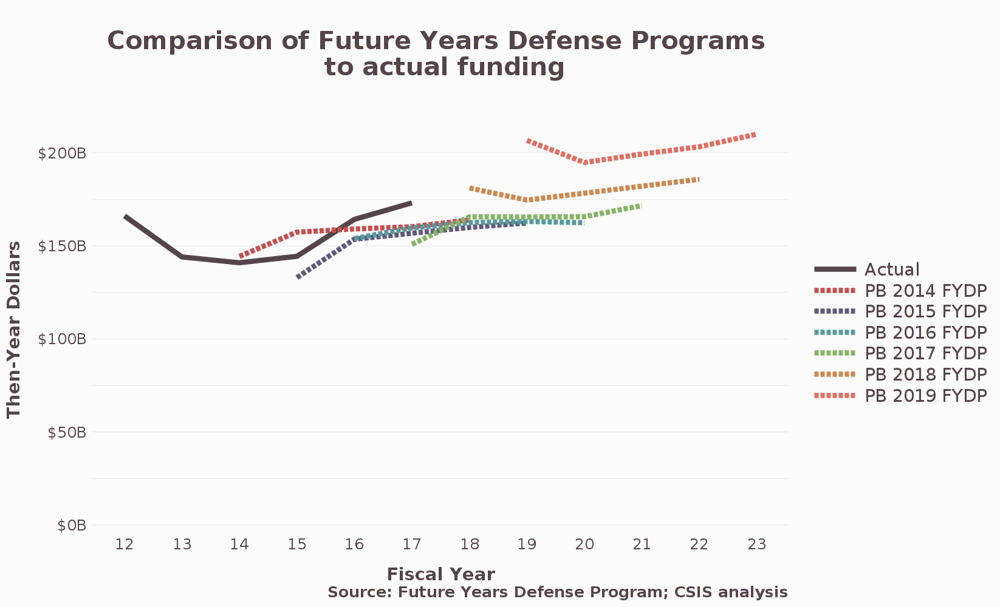

# fydp

**Screenshots** 

 

**Overview** 
The Future Years Defense Program (FYDP) is a five-year plan for the Department of Defense (DoD) released most years with the President's budget request. This valuable resource provides budget projections down to the project level, thereby making it possible to analyze DoD's plans for future investments and to assess how these investments support U.S. defense strategy. However, the FYDP data released publicly by DoD is difficult to analyze because it is buried in hundreds of separate PDF documents.  
We embarked on a project to create a centralized FYDP database and series of apps. We have designed these apps for outside analysts and congressional staffers, and we are making them available to anyone. This is part of a broader effort to create tools that make it easier to understand and plan for defense investments.  
These apps include historical FYDP data from the President's budget requests for FY 2014 through FY 2019, for Procurement and Research, Development, Test and Evaluation (RDT&E) accounts, and for Army, Navy, and Air Force accounts. Our sources include the P-40 (for procurement) and R-2 (for RDT&E) documents within the DoD justification books, as well as the DoD Greenbook and the OMB budget database.

